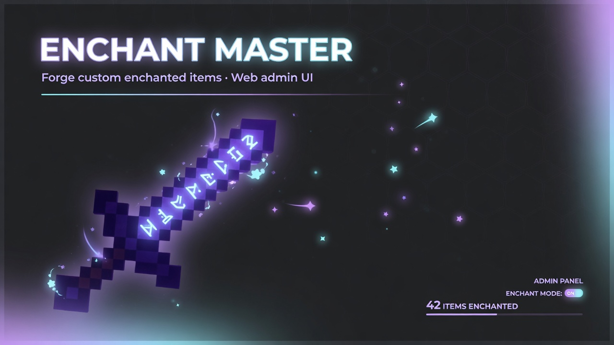
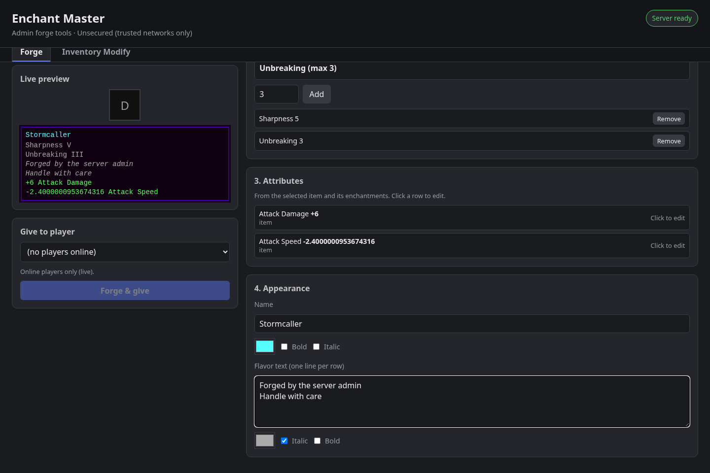
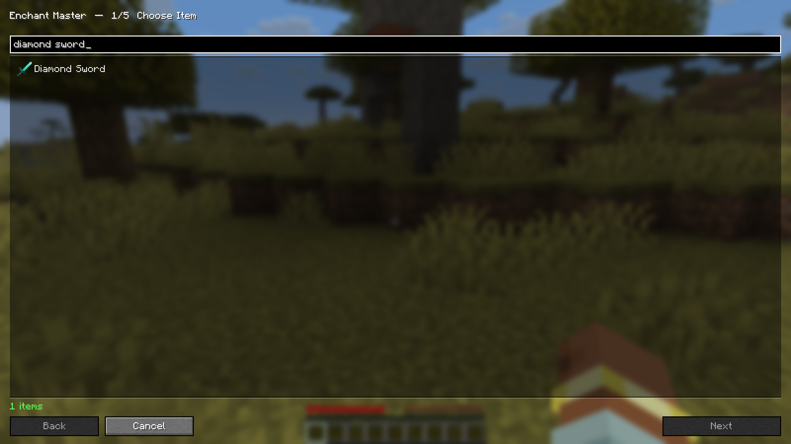
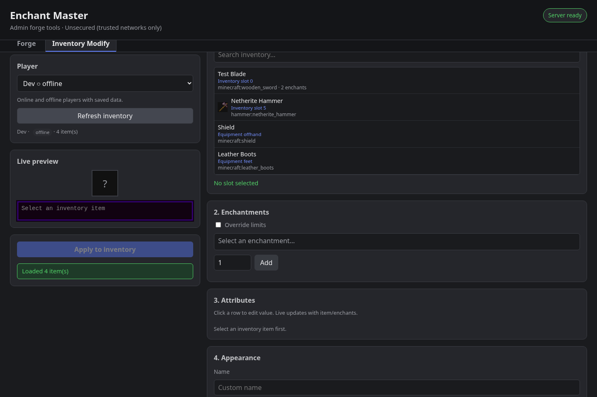
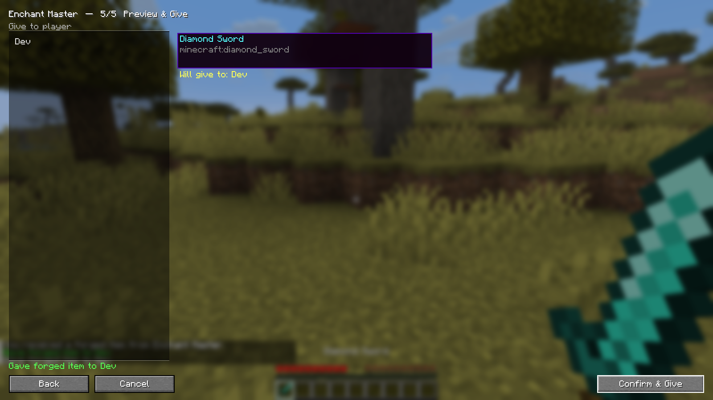

# Enchant Master

**Admin forge toolkit** for Minecraft servers: create and edit items with custom enchantments, attributes, names, and lore — from a **web UI** or an optional **in-game UI**.

| | |
|---|---|
| **Latest** | `1.0.5` |
| **License** | MIT |
| **Primary target** | NeoForge **26.1.x** (also ports for 1.16.5 → 1.21.x) |
| **Deploy model** | **Server-only** safe; client JAR optional for in-game UI |



---

## Features

- **Forge items** — pick any registered item (vanilla + modded), stack enchantments, attributes, custom name, and flavor text.
- **Override limits** — optional over-max levels and exclusive-enchant conflicts (capped by config).
- **Inventory Modify** — edit items already in a player’s inventory (online or offline), including nested containers/bundles where the port supports it.
- **Web admin UI** — OP starts/stops an embedded HTTP server; dark modern UI with live tooltip preview.
- **Optional in-game UI** — operators who also install the client mod can run `/enchantmaster open`.
- **Access control** — whitelist the OP’s connection IP on start, optional same-LAN and CIDR allowlists.
- **Audit log** — forge / inventory / web events to `logs/enchantmaster-audit.log`.

### Screenshots

| Web UI | In-game UI |
|--------|------------|
|  |  |
|  |  |

More images: [`docs/media/`](docs/media/).

---

## Downloads

Prefer **GitHub Releases** — each file is labeled for a specific Minecraft + loader version.

**Pick the jar that matches your server’s Minecraft version and loader** (Forge vs NeoForge). Using the wrong loader will not load.

### Supported lines (1.0.5)

| Minecraft | Loader | Notes |
|-----------|--------|--------|
| 26.1.x / 26.2.x | NeoForge | Mainline development target |
| 1.21 – 1.21.8, 1.21.11 | NeoForge | Real ports under `ports/` |
| 1.20.2, 1.20.4, 1.20.6 | NeoForge | Server + web primary |
| 1.20.1 | **Forge** | No NeoForge for 1.20.1 |
| 1.16.5 | **Forge** | No NeoForge for 1.16.5 |

See [docs/wiki/Versions.md](docs/wiki/Versions.md) for supported Minecraft / loader lines.

---

## Multiplayer deployment (server-only)

| Who | Needs the JAR? | Capabilities |
|-----|----------------|--------------|
| Dedicated server | **Yes** | Web UI, forge APIs, inventory tools |
| Normal players | **No** | Join normally |
| Operators | Client JAR **optional** | Web always (after OP start). In-game UI only with client mod |

Network channels are **optional**. Clients without Enchant Master are not kicked for missing channels.

```text
Server mods/     → enchantmaster-….jar   (required)
Players          → no client jar needed
OP + client jar  → /enchantmaster open
```

The web server does **not** auto-start. Console or an OP must run:

```text
/enchantmaster web start
/enchantmaster web stop
/enchantmaster web status
```

---

## Commands

| Command | Who | Effect |
|---------|-----|--------|
| `/enchantmaster web start` | OP / console | Start web UI; whitelist OP connection IP when access control is on |
| `/enchantmaster web stop` | OP / console | Stop web UI; clear player IP whitelist |
| `/enchantmaster web status` | OP / console | Show bind / public URL / access state |
| `/enchantmaster open` | OP **with client mod** | Open in-game forge UI |

---

## Quick start

1. Install the matching **Forge** or **NeoForge** for your Minecraft version.
2. Drop the Enchant Master jar into the server’s `mods/` folder.
3. Start the server once to generate `config/enchantmaster-server.toml`.
4. From console or as OP: `/enchantmaster web start`.
5. Open the printed URL (default often `http://127.0.0.1:25570` or your `publicUrl`).
6. Use **Forge** to create items, or **Inventory Modify** to edit existing stacks.

> **Security:** There is **no web login**. Only expose the port on trusted networks, or put it behind a reverse proxy and tighten access control. See [wiki: Security](docs/wiki/Security.md).

---

## Configuration

Server config (created on first load):

```text
config/enchantmaster-server.toml
```

Key options under `[web]`:

| Option | Purpose |
|--------|---------|
| `host` | Bind address (`0.0.0.0` all interfaces, `127.0.0.1` local/proxy only) |
| `port` | Bind port (default `25570`) |
| `publicUrl` | URL shown to ops (HTTPS / reverse-proxy path). Empty → derived from host+port |
| `accessControl` | If true, only allowed IPs can use the web UI |
| `allowPlayerLan` | Also allow same private LAN (/24) as whitelisted player IPs |
| `allowedSubnets` | Extra always-allowed CIDRs |
| `allowLocalhost` | Always allow loopback when access control is on |
| `trustProxyHeaders` | Honor `X-Forwarded-For` / `X-Real-IP` (trusted proxy only) |
| `maxOverrideLevel` | Cap for override-mode enchant levels |

Config upgrades preserve existing keys and only add missing defaults.

### Audit log

| Event | When |
|-------|------|
| `WEB_START` / `WEB_STOP` | Web UI toggled |
| `WEB_DENIED` | HTTP blocked by access control |
| `FORGE` | Item forged and given |
| `INVENTORY_MODIFY` | Inventory stack rewritten |

Written to `logs/latest.log` (`[AUDIT]`) and `logs/enchantmaster-audit.log`.

---

## Building from source

```bash
# Mainline (NeoForge 26.1.x) — Java 25 toolchain as required by NeoForge 26
./gradlew build

# Example port
cd ports/neoforge-1.21.1 && ./gradlew jar
cd ports/forge-1.20.1 && ./gradlew build
```

Matrix jars for multi-version builds live under `ports/*/build/libs/` and may be collected in `dist/matrix/` for releases.

**Maintainers / agents:** multi-version testing and release process is documented in [AGENTS.md](AGENTS.md).

---

## Documentation

| Doc | Description |
|-----|-------------|
| [Wiki home](docs/wiki/Home.md) | Full user + admin documentation (also publishable to GitHub Wiki) |
| [Media](docs/media/README.md) | Screenshots for README / releases |

---

## Compatibility

- Designed for **modpacks**: item/enchant/attribute lists come from live registries.
- Server-only install does not require players to download the mod.
- Nested backpacks (e.g. Sophisticated Backpacks) are best-effort via reflection on modern ports.

---

## Contributing & support

- Issues and PRs welcome at [Tech-Daddy-Digital/EnchantMaster](https://github.com/Tech-Daddy-Digital/EnchantMaster).
- Please include Minecraft version, loader version, and whether the issue is web UI, in-game UI, or server-side.

---

## License

MIT — see [LICENSE](LICENSE).

Originally bootstrapped from a NeoForged MDK layout.
